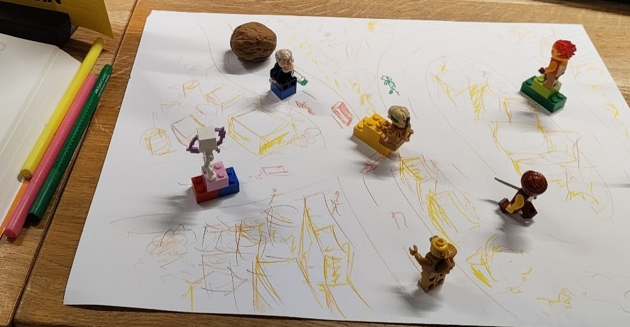

# Was de Walnuss?! 🌰

_Ein roller-Spiel, in dem du eine riesige Walnuss steuerst und dabei herausfindest, ob es besser ist, alles oder gar nichts zu sammeln._

Prototyp entwickelt in einem Tag am [Code Dojo](https://codedojo.ch) in [Erupt Lounge](https://erupt.ch). Merci an alle teilnehmende!

Programmiert in [LittleJS](https://littlejsengine.com/) mit unterstützung von:

- [Apertus](https://apertus-ai.org) und [Inkling](https://thinkingmachines.ai/news/introducing-inkling/)
- [Zed](https://zed.dev/) und [GIMP](https://www.gimp.org/)

---

## Konzept

**Was de Walnuss?!** ("Wo ist die Walnuss?!" auf Berner Mundart) ist ein charmantes Massen-Sammelspiel, das sich von Klassikern wie *Katamari Damacy*, *What the Car?* und *Pilotifant* inspirieren lässt. Du steuerst eine rollende Walnuss durch die Straßen und musst durch geschicktes Sammeln zum anderen Stadtende gelangen.

 

## Spielmechaniken

### Der Sammelzyklus
- **Rollen**: Bewege die Walnuss durch präzise Steuerung (Power-to roll schnell, präzise Richtungsstufen)
- **Wachsen**: Sammle kleinere Objekte (Blätter, Steine, Krümel), um zu wachsen und größere Dinge aufnehmen zu können
- **Grenzen finden**: Größere Walnuss = mehr Zerstörung = Punkteabzug, aber du musst genug wachsen, um bestimmte Levelziele zu erreichen

### Was du sammeln kannst
- **Berner Alltagsobjekte**:
  - Fahrräder, Einkaufstaschen, Zeitungshütten
  - Tramwagen (achte auf die Schienen!)
  - Parkbänke, Mülltonnen, Straßenlaternen
- **Besondere Schweizer Gegenstände**:
  - Schweizer Armeemesser → temporäre Hilfsmittel (Leiter, Kran)
  - Uhren → Zeitbonus für eine begrenzte Dauer
  - Käse-Wedge → lockt neugierige Kühe an 🐄
- **Sanfte Minispiele**:
  - Blumen und Recyclingkörbe sammeln → Umwelt-Gesundheitspunkte
  - Durstlöscher im Brunnen → Wallnuss erhält Wasserschutz-Badge

### Zerstörung und Konsequenzen
- Jedes gerammelte Objekt kostet Punkte
- **Swiss Precision-Boni**: Sorgfältiges Sammeln ohne Kollission gibt Bonuspunkte
- **UNESCO-Regeln**: Das Berner Altstadt UNESCO-Weltkulturerbe kann nicht zerstört werden!
- **Gewichtung**: Große Objekte verursachen proportional mehr Zerstörung, aber geben auch mehr Punkte

### Kultur und Humor
- **Sprache**: UI in Berner Mundart mit deutschen/englischen Optionen
- **Jahreszeiten**: Frühlingsblumen in der Altstadt, Winterschnee auf Gurten
- **Spezialitäten**: Schokoladenbarren für Geschwindigkeitsschübe ("Schokolade macht schneller!")
- **Präzision**: Schweizer Zugfahrpläne – wenn du pünktlich bist, bekommst du ein Zeitfenster
- **Aare-Brücke**: Balance-Mechanik – zu schwere Walnuss wackelt wie ein wackeliger Berner Tram!

## Ausrichtung

✅ **Freundlich & Ungefährlich**
- Nur unbelebte Gegenstände werden "verschlungen", keine Personen oder Tiere werden verletzt
- Humorvolle Darstellung: die Walnuss wirkt wie ein hungriges, neugieriges Wesen
- Bunte, einladende Grafik mit bernischem Rot-Gelb-Grün

✅ **Bildend durch Spielen**
- Sammeln bestimmter Objekte gibt spielerisch Fakten über Schweizer Kultur preis
- Umweltbewusstseinsthemen: Recycling und Nachhaltigkeit durch "grüne" Sammelobjekte

✅ **Kooperative Optionen**
- Mehrere Spieler steuern separate Walnüsse und müssen zusammenarbeiten, um große Objekte zu bewegen
- Teamfähigkeit fördert, ohne jemanden zu bekämpfen

## Entwicklungsziele

1. **Spielbare Demo**: Erste Phase – Walnuss steuern, kleine Objekte sammeln
2. **Level-Struktur**: Altstadt-Teststrecke mit Präzisions-Hindernissen
3. **Produktionssequenz**: Infrastructure-Schäden vs. Umwelt-Belohnungen balancen
4. **Mehrspieler**: Co-op Mode mit getrennten Controllern
5. ** Editions**: "Berner Touristenmodus" (einfacher), "Härde Berner Modus" (realistische Präzision)

